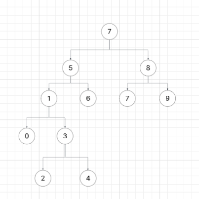

# Patika.dev - Veri Yapıları ve Algoritmalar: Binary Search Tree Ödevi

Bu belge, patika.dev'in Veri Yapıları ve Algoritmalar dersinin Binary Search Tree ödevi kapsamında hazırlanmıştır.

---

## Proje 3

### 1. [7, 5, 1, 8, 3, 6, 0, 9, 4, 2] dizisinin Binary Search Tree (BST) aşamalarını yazınız:

```
[7]  
[7, 5]  
[7, 5, 1]  
[7, 5, 1, 8]  
[7, 5, 1, 8, 3]  
[7, 5, 1, 8, 3, 6]  
[7, 5, 1, 8, 3, 6, 0]  
[7, 5, 1, 8, 3, 6, 0, 9]  
[7, 5, 1, 8, 3, 6, 0, 9, 4]  
[7, 5, 1, 8, 3, 6, 0, 9, 4, 2]  
```

---

### 2. Oluşan Binary Search Tree yapısı:


